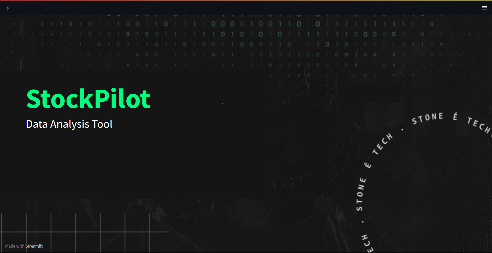
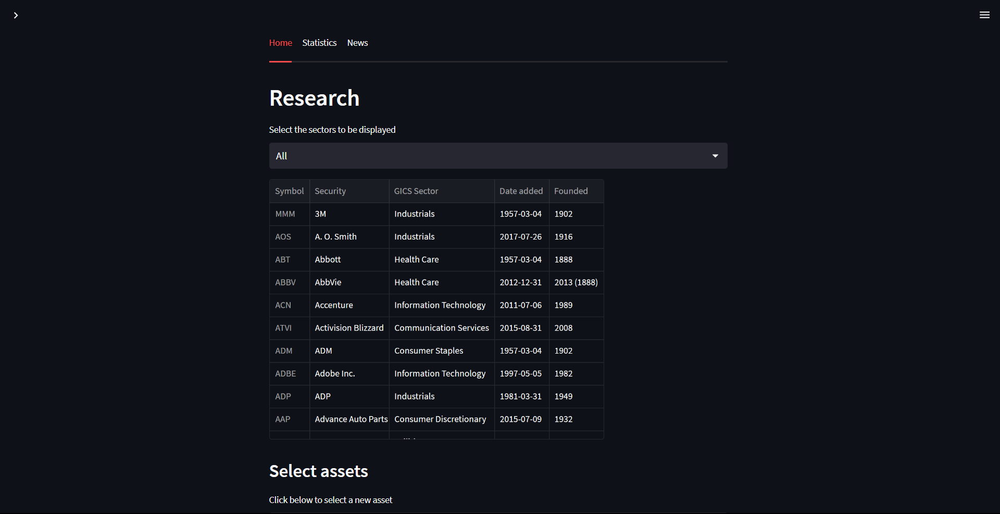
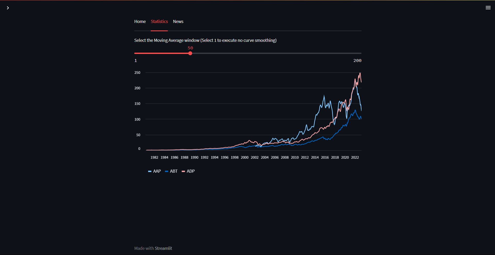
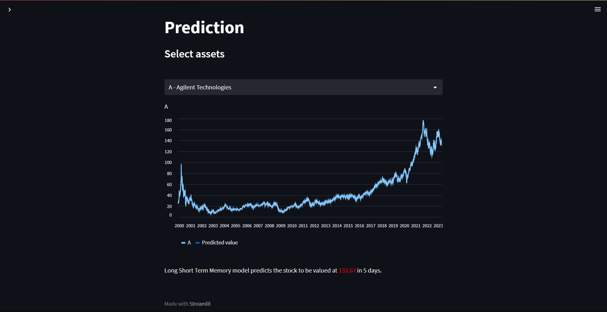

## Introduction

This dashboard is a web app designed with Streamlit. This web-interface is built for your personal virtual assistantance for Stock Market Investments. From the visualization of recent stock price variations for any of the current Top 100 NASDAQ companies, to recent articles about these companies, you can explore sources of information to make accurate decisions for your next trades.

## Design process and features of dashboard
* Our design process is inspired by the following definition of dashboard "Visual display of the most information needed to achieve one or more objectives
which fits entirely on a single computer screen so it can be monitored at a glance".
* We have made sure that the essential components of the dashboard fits on a single computer screen. The objective is to have the most important information readily and effortlessly available so you can quickly absorb what you need to know.
* Our dashboard is small, concise, clear and intuitive. We have designed the display mechanisms such that they clearly state their message without taking up much space are required, so that the entire collection of information will fit into the limited real estate of a single screen.
* The dashboard is interactive and tailored to the specific needs of the user. The user can avoid all the necessary information and focus only on what is important.
* We have tried to keep similar data together so that the information that appears on the dashboard does not look fragmanted. We have kept different tabs for different kinds of information enabling users to navigate to discrete screens or different instances of a single screen to access additional information. 
* We have supplied adequate context for the data so that data could be interpreted rightly.
* We have chosen scatter plot to show the trend of stock prices which is a standard.







## Installation

Firstly, ensure that you have pip install. In which case follow these steps using the command line:

```
curl https://bootstrap.pypa.io/get-pip.py -o get-pip.py
python get-pip.py
```

Then install the required libraries listed in the requirements.txt
```
pip install -r requirements.txt
```

## Requirements

Create an account on [newsapi](https://newsapi.org/) to get an API key. Then add it to the file *api_key.json*. I have used my own API key as of now for demo purposes so you can run it without needing an API key.

## Usage Example
```
streamlit run app.py
```
